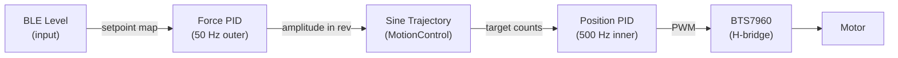

Here is a diagram of the cascaded control loop:



---

Here is a diagram of our module architecture:

```mermaid
flowchart TB

    PHONE["Phone App"]

    MAIN["main.cpp\n---\nsetup()\nloop()\nforceLogTask()"]

    PPG["PPGModule\n---\nbegin()\nupdate()\nisSessionActive()\ngetCompressionLevel()\ngetCompressionType()\nlogForceData()"]

    FC["ForceControl\n---\nbegin()\nreadForce()\nsetForceSetpoint()\ngetDesiredRevolutions()\nstartPeakTracking()\ncomputeNextAmplitude()"]

    MC["MotionControl\n---\nbegin()\nexecutePattern1to5()\nrunSineCycle()\nupdateMotorState()"]

    BTS["BTS7960\n---\nbegin()\nset()\ncoast()\nbrake()"]

    ENC["EncoderModule\n---\nbegin()\ngetPosition()\nresetPosition()"]

    LIM["LimitSensors\n---\nbegin()\nisTriggered()\nclearFlags()\ncheckPendingTriggers()"]

    PID["PIDController\n---\ninit()\ncompute()\nsetSetpoint()\nreset()"]

    CFG["config.h\n---\nPin definitions\nPID gains\nTiming constants\nBLE UUIDs"]

    subgraph HW["Hardware"]
        MOTORS["DC Motors x3"]
        ENCODERS["Encoders x3"]
        FORCE_S["Force Sensors x3"]
        LIMIT_S["Limit Switches x3"]
        MAX30["MAX30105 PPG"]
        SD["SD Card"]
    end

    PHONE <-->|BLE| PPG
    PPG <-->|"Session state / Level / Type / Stop flag"| MAIN

    MAIN -->|setForceSetpoint| FC
    FC -->|"getDesiredRevolutions / amplitudes"| MAIN

    MAIN -->|"executePatternN / motor / amplitudes"| MC

    MAIN -->|readForce| FC
    MAIN -->|logForceData| PPG

    MC <-->|"compute / setSetpoint"| PID
    MC -->|"set / coast"| BTS
    MC -->|getPosition| ENC
    MC -->|isTriggered| LIM
    MC -->|startPeakTracking| FC

    FC <-->|"compute / setSetpoint"| PID

    BTS -->|LEDC PWM| MOTORS
    MOTORS --> ENCODERS
    ENCODERS -->|PCNT counts| ENC
    LIMIT_S -->|GPIO ISR| LIM
    FORCE_S -->|ADC read| FC
    MAX30 -->|I2C| PPG
    PPG -->|SPI| SD

    CFG -. constants .-> MAIN
    CFG -. constants .-> FC
    CFG -. constants .-> MC
    CFG -. constants .-> BTS
    CFG -. constants .-> ENC
    CFG -. constants .-> PPG